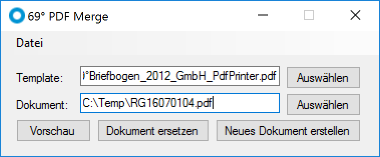

# 69° PDF Merge

## What does it do?

If you think of a letter you would usually print on your company's stationary using your office laser or ink-jet printer, this is what you also want to do in the digital world: "printing" your (PDF) documents on your personalized (PDF) stationery. And this is what this tool does.

## And why is the code so messed up?

I wrote this tool approximately in 2009 in a cloak-and-dagger operation and never intended to maintain it or even publish it. And while it is published now, I still don't think it will get updates any time soon (at least not by me). So, here it is, deal with it :).

## Credits

Most of the work is done by [PDFsharp](http://www.pdfsharp.net/). Thanks, guys!
